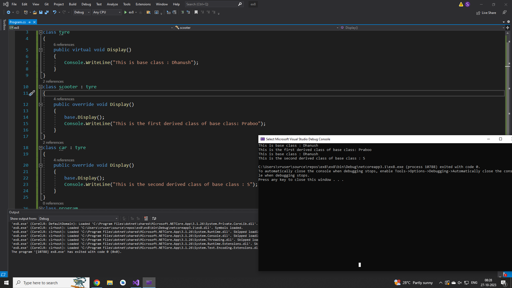

# Inheritance

## Aim:
To write a C# program to print some messages using hierarchical inheritance

## Algorithm:
### step 1:
Create a base class.

### step 2:
Create two child class.

### step 3:
Create a constructor in the base class and print a message.

### step 4:
create a function in child class to print a message.

## Program:
~~~
using System;

class tyre
{
    public virtual void Display()
    {
        Console.WriteLine("This is base class : Dhanush");
    }
}
class scooter : tyre
{
    public override void Display()
    {
        base.Display();
        Console.WriteLine("This is the first derived class of base class: Praboo");
    }
}
class car : tyre
{
    public override void Display()
    {
        base.Display();
        Console.WriteLine("This is the second derived class of base class : S");
    }
}
class program
{
    static void Main()
    {
        scooter s = new scooter();
        s.Display();
        car c = new car();
        c.Display();
    }
}
~~~

## Output:

## Result
C# program to print some messages using hierarchical inheritance is implemented successfully.
